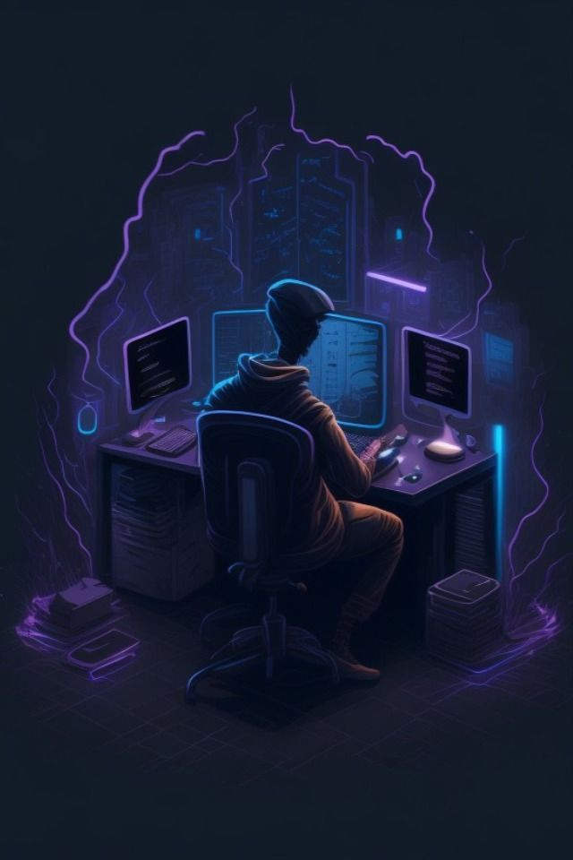

<a name="readme-top">

 

 

  
  <h3 align="center">Hero Section Design</h3>

  A project showcasing a hero section design for a website.

 

---

 
 

  
Table of Contents

  <ol>
    <li>
      <a href="#overview">Overview</a>
      <ol>
        <li>
          <a href="#key-components">Key Components</a>
        </li>
        <li>
          <a href="#technology">Technology</a>
        </li>
      </ol>
    </li>
    <li>
      <a href="#rules-practices-and-principles">Rules, Practices and Principles</a>
    </li>
    <li>
      <a href="#resources">Resources</a>
    </li>
  </ol>

---

## Overview

The Hero Section Design project demonstrates the implementation of a hero section for a website, featuring a welcome message, a description, and inspirational quotes. This project utilizes modern web design techniques to create an engaging and visually appealing hero section.

Guiding Question:
- What is the project?  
  This project is about designing a hero section for a website.
- What's the purpose?  
  To create a stunning and functional hero section that captures the visitor's attention.
- What are key components?  
  The main introductory section and the inspirational quotes section.
- What technology used and how it is used?  
  HTML and CSS for structure and styling, Font Awesome for icons.

### Key Components
- Single Page Website
- Responsive design
- Integrated Font Awesome icons

### Technology

## Rules, Practices and Principles
1. Always use `WD-` in the front of the Title of the Project for the Subject followed by your custom naming.
2. Do not rename any .html files; always use `index.html` as the filename.
3. Place files in their respective folders.
4. All file naming is in camel case.
   - Camel case is a naming format where there is no white space in the separation of each word; the first word is all lowercase while the succeeding words' first letters are uppercase followed by lowercase letters.
   - ex.: `buttonAnimatedStyle.css`
5. Use only `External CSS`.
6. Renaming of Pages folder names is a must and should relate to what it is doing or the data it holds.
7. File Structure to follow below.

WD-Hero-Section-Design
└─ assets
| └─ css
| | └─ style.css
| └─ img
| | └─ nyebe_white.png
| └─ js
| └─ script.js (if needed)
└─ index.html
└─ readme.md

## Resources

| Title | Purpose | Link |
|-|-|-|
| Font Awesome | Icon library used in the project | [fontawesome.com](https://fontawesome.com) |
| CSS Tricks | A collection of useful CSS techniques and tips | [css-tricks.com](https://css-tricks.com) |
| MDN Web Docs | Comprehensive documentation for web development | [developer.mozilla.org](https://developer.mozilla.org) |
